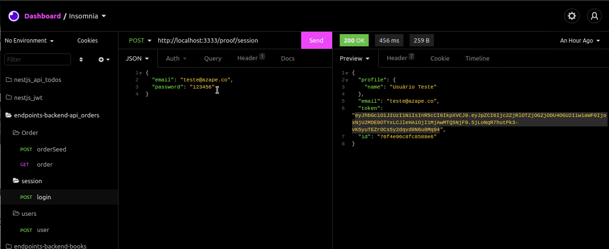

# 💸 Api of Orders AZAPE

Node Api with JWT for to verify a list of orders.


## 💡 Project and endpoints

Import file called endpoints_api_azape.json in your insomnia or postman.

<div align="center" >
  
</div>


## Run Locally

Clone the project

```bash
  git clone https://github.com/thurdelima/az_proof_initial_api
```

Go to the project directory

```bash
  cd az_proof_initial_api
```

Install dependencies

```bash
  npm install
```

Configure .ENV vars and import endpoints_api_azape.json in your postman or insomnia.

Seed fake data orders

And

```bash
  npm run dev

```


